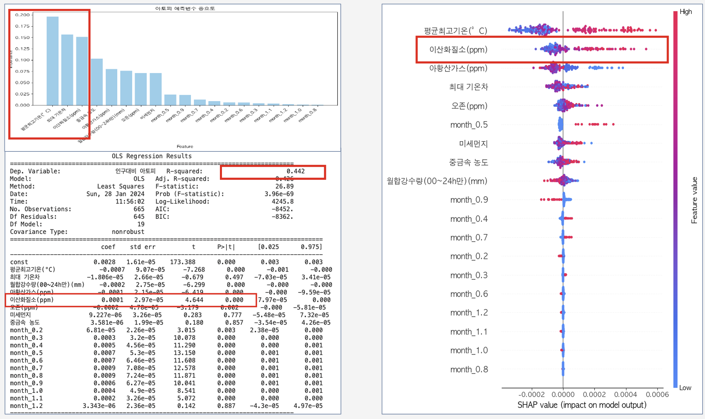

# 🌿 환경성 질환지수 개선 방안 제안

### 10년치 공공데이터로 분석한 비염·천식·아토피의 패턴과 환경 요인

> DSL EDA Project — 의료 2팀 (4인)  
> 공공데이터 기반 환경성 질환 진료 에피소드 분석 및 네이버 생활·보건지수 개선안 도출



---

## 📎 Documents

- [📑 발표자료 (PDF)](docs/환경성질환지수개선_발표자료.pdf)

---

## 📊 Project Overview

네이버 기상에서 제공하는 **생활·보건지수**는 천식만을 다루며, 지역 맞춤화 기능이 없고 활용 변수가 불투명하다는 한계가 있습니다.

본 프로젝트는 이 한계를 데이터로 검증하고, **비염·아토피·천식** 3개 환경성 질환에 대한 개선된 지수 산출 방안을 제안합니다.

## 👤 기여 파트 (본인 담당)
 
> 팀 프로젝트로 진행되었으며, 본인의 주요 기여 파트는 다음과 같습니다.
 
- ✅ **주제 선정** — 네이버 생활·보건지수의 한계(질환 범위, 지역 맞춤화 부재, 변수 불투명) 도출 및 분석 방향 설정
- ✅ **데이터 수집** — 국민건강보험공단 환경성질환 진료 에피소드, 행정안전부 주민등록인구, 기상청 데이터 등 수집 및 통합 (총 353,783 rows)
- ✅ **성별·연령 분석 (Part 1)** — 인구 표준화 후 성별·연령군별 월간·연간 진료 에피소드 추이 분석, 코로나 영향 구간(2020.02) 식별 및 질환별 영향 차이 해석
- ✅ **지역 분석 (Part 2)** — 17개 시도·시군구별 1인당 진료 에피소드 분석, ADF 검정으로 계절성 확인, 동-서·남-북 지역 격차 및 세종시 이상치 발견
- ✅ **결론 도출** — 질환별 주요 인사이트 종합 및 생활·보건지수 개선안(지역 가중치, 연령 가중치, 추가 변수) 제안


### 🔍 문제 정의

| 문제 | 내용 |
|------|------|
| 질환 범위 부족 | 천식 외 비염·아토피 지수 부재 |
| 지역 맞춤화 부재 | 전국 단일 지수 제공, 지역별 차이 미반영 |
| 변수 불투명 | 기온·일교차 외 실제 활용 변수 불명확 |

### 🎯 분석 목표

> **생활·보건지수를 확장 및 개인 맞춤화하여 개선할 수 있지 않을까?**

- 성별·연령별 진료 에피소드 패턴 분석
- 지역별 환경성 질환 분포 및 격차 파악
- 기상·대기오염 변수와 질환 간 회귀 분석
- 질환별 맞춤 지수 개선안 도출

---

## 🗂 Data Sources

| 데이터 | 출처 | 기간 | 변수 |
|--------|------|------|------|
| 환경성 질환 진료 에피소드 | 공공데이터포털 (국민건강보험공단) | 2013~2022 | 시도·시군구, 성별, 연령군, 진료 에피소드 수 |
| 대기오염도 | KOSIS 국가통계포털 | 2013~2019 | PM10, SO₂, NO₂, O₃, 중금속 농도 |
| 기상 데이터 | 기상청 기상자료개방포털 | 2013~2019 | 평균·최저·최고기온, 기온차 |
| 인구 현황 | 행정안전부 주민등록인구 | 2013~2022 | 성별·연령별·지역별 인구 |

- **총 데이터 규모**: 353,783 rows (non-null)
- **분석 단위**: 1인당 진료 에피소드 발생 건수 (인구 표준화)

---

## 🛠 Analysis Pipeline

```
데이터 수집 → 인구 표준화 → 탐색적 분석(EDA) → 전처리 → 회귀 모델링 → 인사이트 도출
```

### 전처리 주요 과정 (Part 3 환경 파트)

- 로그 변환 → 이상치 제거(Box-and-whisker) → Standard Scaling
- Shapiro-Wilk 정규성 검정 결과 비모수 확인 → **Spearman 상관분석** 적용
- VIF 기반 다중공선성 제거 (기온 변수 중 평균 최고기온만 사용, `month` 변수만 사용)
- 코로나 기간(2020~) 데이터 변동 배제 → **2013~2019 데이터만 분석에 활용**

---

## 📈 Key Findings

### Part 1 · 성별 & 연령 분석

> **담당: 팀장 (주제선정, 데이터 수집, 분석, 결론 도출)**

**성별**
- 3개 질환 모두 여성의 인구 대비 진료 에피소드 건수가 남성보다 높음
- 2019년 이후 아토피의 성별 격차가 **약 1.6배 확대** (여성 증가 / 남성 감소)
- 2020.02 코로나 기점으로 비염·천식은 급감, 아토피는 영향 거의 없음
  - 비염: 2020년 남성 **-37.6%**, 여성 **-40.5%** 감소
  - 아토피: 코로나 영향 거의 없음 → 호흡기 질환이 아닌 특성 반영

**연령**
- 천식·비염: **0~11세 유소년** 비율이 타 연령 대비 약 **3.3배** 높음
- 아토피: **18~44세 성인** 비율이 10년간 **4배 이상** 증가
- 천식: 12세 이후 급격히 감소, 65세 이상에서 다시 소폭 상승

---

### Part 2 · 지역 분석

- ADF 검정으로 **계절성 확인** → 비염·천식은 여름 낮고 9월 급증, 아토피는 반대
- **세종시**가 3개 질환 모두에서 인당 진료 에피소드 수 최상위
- 아토피·천식에서 **동-서 간 격차** 뚜렷 (황사·대기오염 지리적 요인 가능성)
- 비염·천식에서 **남-북 간 격차** 확인 (기온 영향 가능성)

| 질환 | 시도 Top 3 | 시도 Bottom 3 |
|------|-----------|--------------|
| 아토피 | 세종, 대전, 인천 | 경남, 경북, 부산 |
| 천식 | 세종, 광주, 전남 | 강원, 부산, 서울 |
| 비염 | 세종, 인천, 제주 | 강원, 경북, 서울 |

---

### Part 3 · 환경 변수 회귀 분석

- **OLS 회귀 + Random Forest + SHAP** 활용
- 모델 설명력(R²): 아토피 0.44 / 천식 0.55 / 비염 **0.76**

| 질환 | 주요 영향 변수 |
|------|--------------|
| 아토피 | 평균 최고기온(↑), 이산화질소(↑) — 실내 환경·개인차 영향 커 설명력 낮음 |
| 천식 | 이산화질소(↑), 미세먼지(↑), 중금속 농도(↑), 기온(↑ 시 ↓) |
| 비염 | 평균 최고기온(↑), 이산화질소(↑), 강수량(↑), 미세먼지(↑) |

---

## 💡 개선 제안

| 질환 | 개선안 |
|------|--------|
| **아토피** | 여름철 가중치 부여, 연령군 변수 추가, 세종·대전·인천 고위험 지역 설정, 실내 환경 데이터 추가 수집 요망 |
| **천식** | 환절기 변수 추가, 0~11세 유소년 가중치 부여, 세종·전남·광주 고위험 지역 설정, 미세먼지·이산화질소·중금속 농도 반영 |
| **비염** | 환절기 변수 추가, 6~11세 유소년 가중치 부여, 세종·인천·제주 고위험 지역 설정, 미세먼지·이산화질소·강수량 반영 |

---

## 👥 Team & Role

| 이름 | 역할 |
|------|------|
| 박성원 (팀장) | **주제 선정, 데이터 수집, Part 1 성별·연령 분석, Part 2 지역 분석, 결론 도출** |

---

## 🔧 Tech Stack

`Python` `Pandas` `Matplotlib` `Seaborn` `Statsmodels` `Scikit-learn` `SHAP`  
`공공데이터포털` `KOSIS` `기상청 기상자료개방포털`
